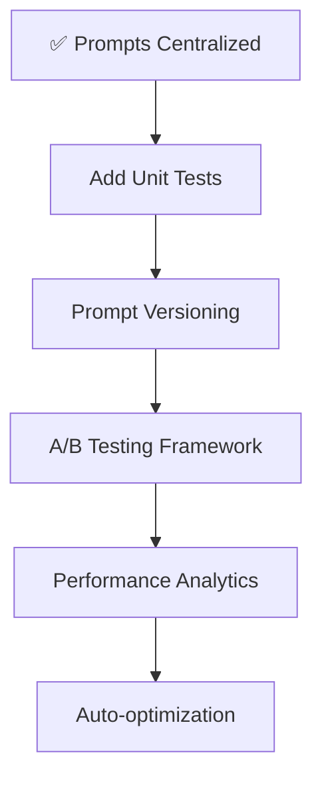

# LLM Prompts Architecture

## Current: Modular Prompt Files

```
┌─────────────────────────────────────────────────────────┐
│                   prompts/ Folder                        │
│           (Single Source of Truth)                       │
├─────────────────────────────────────────────────────────┤
│                                                           │
│  query-generator-system.md                               │
│  ├─ Mode A (schema provided)                            │
│  ├─ Mode B (schema missing)                             │
│  └─ Mode C (inferred standard D365 tables) ← NEW       │
│                                                           │
│  query-generator-output.md                               │
│  ├─ JSON response format                                │
│  ├─ confidence: "high"|"medium"|"inferred" ← NEW       │
│  └─ assumedSchema: string[] ← NEW                      │
│                                                           │
│  intent-classifier-system.md                             │
│  ├─ Question categorization logic                       │
│  └─ Multi-step detection                                │
│                                                           │
│  multi-step-workflow-system.md                           │
│  ├─ Complex query handling                              │
│  └─ Step decomposition                                  │
│                                                           │
│  query-review-system.md                                  │
│  ├─ SQL validation rules                                │
│  └─ CTE support (WITH...SELECT) ← NEW                  │
│                                                           │
│  result-insights-system.md                               │
│  ├─ Result analysis                                     │
│  └─ Business insights generation                        │
│                                                           │
└─────────────────────────────────────────────────────────┘
                            │
                            │ Read by
                            ▼
    ┌───────────────────────────────────────────────┐
    │        server/queryGenerator.ts                │
    ├───────────────────────────────────────────────┤
    │                                                 │
    │  generateQuery()                               │
    │  ├─ Load prompt from query-generator-system.md│
    │  ├─ Mode C: Infers standard D365 tables       │
    │  ├─ Returns: { sql, confidence, assumedSchema}│
    │  └─ Sets pendingExecution: true ← NEW         │
    │                                                 │
    │  CTE Validation                                │
    │  ├─ Supports WITH...SELECT queries ← NEW      │
    │  └─ Validates against dangerous keywords       │
    │                                                 │
    └───────────────────────────────────────────────┘
                            │
                            │ Used by
                            ▼
    ┌───────────────────────────────────────────────┐
    │            server/routers.ts                   │
    ├───────────────────────────────────────────────┤
    │                                                 │
    │  query.generate ← NEW (separated from execute)│
    │  ├─ Generates SQL                              │
    │  ├─ Returns pendingExecution: true            │
    │  └─ Does NOT auto-execute                     │
    │                                                 │
    │  query.executeSql ← NEW                        │
    │  ├─ Validates SQL                              │
    │  ├─ Executes on user approval                 │
    │  └─ Returns results                            │
    │                                                 │
    └───────────────────────────────────────────────┘
                            │
                            │ Consumed by
                            ▼
    ┌───────────────────────────────────────────────┐
    │        client/src/pages/Chat.tsx               │
    ├───────────────────────────────────────────────┤
    │                                                 │
    │  Generate Query (generateQuery mutation)       │
    │  ├─ Shows SQL preview                          │
    │  ├─ Displays token cost                       │
    │  └─ Confidence level indicator                │
    │                                                 │
    │  Run Query Button ← NEW                        │
    │  ├─ Manual execution trigger                   │
    │  ├─ User reviews SQL before running           │
    │  └─ Calls executeSql mutation                 │
    │                                                 │
    │  Copy All Context Button ← NEW                 │
    │  ├─ Exports full conversation                  │
    │  └─ For documentation/troubleshooting         │
    │                                                 │
    └───────────────────────────────────────────────┘
```

## Before: Scattered Prompts (Historical Reference)

```
┌─────────────────────────────────────────────────────────┐
│                   Application Code                       │
├─────────────────────────────────────────────────────────┤
│                                                           │
│  queryGenerator.ts                                       │
│  ├─ const systemPrompt = `...15 lines...`               │
│  └─ Hard to maintain, test, or version                  │
│                                                           │
│  intentClassifier.ts                                     │
│  ├─ const classificationPrompt = `...50 lines...`       │
│  └─ Duplicated logic, hard to update                    │
│                                                           │
│  queryPipeline.ts                                        │
│  ├─ const reviewPrompt = `...25 lines...`               │
│  └─ No type safety, error-prone                         │
│                                                           │
│  resultInsightsGenerator.ts                             │
│  ├─ const analysisPrompt = `...30 lines...`             │
│  └─ Difficult to A/B test or iterate                    │
│                                                           │
└─────────────────────────────────────────────────────────┘
```

## After: Centralized Configuration

```
┌─────────────────────────────────────────────────────────┐
│               server/llm-prompts.ts                      │
│           (Single Source of Truth)                       │
├─────────────────────────────────────────────────────────┤
│                                                           │
│  ┌─────────────────────────────────────────┐            │
│  │  Query Generation                        │            │
│  │  ├─ QueryGeneratorContext (interface)   │            │
│  │  └─ getQueryGeneratorSystemPrompt()     │            │
│  └─────────────────────────────────────────┘            │
│                                                           │
│  ┌─────────────────────────────────────────┐            │
│  │  Intent Classification                   │            │
│  │  ├─ IntentClassificationContext         │            │
│  │  ├─ INTENT_CLASSIFIER_SYSTEM_PROMPT     │            │
│  │  └─ getIntentClassificationPrompt()     │            │
│  └─────────────────────────────────────────┘            │
│                                                           │
│  ┌─────────────────────────────────────────┐            │
│  │  Query Review                            │            │
│  │  ├─ QueryReviewContext                  │            │
│  │  ├─ QUERY_REVIEW_SYSTEM_PROMPT          │            │
│  │  └─ getQueryReviewPrompt()              │            │
│  └─────────────────────────────────────────┘            │
│                                                           │
│  ┌─────────────────────────────────────────┐            │
│  │  Result Insights                         │            │
│  │  ├─ ResultInsightsContext               │            │
│  │  ├─ RESULT_INSIGHTS_SYSTEM_PROMPT       │            │
│  │  └─ getResultInsightsPrompt()           │            │
│  └─────────────────────────────────────────┘            │
│                                                           │
│  export const LLM_PROMPTS = { ... }                      │
│                                                           │
└─────────────────────────────────────────────────────────┘
                            │
                            │ import
                            ▼
    ┌───────────────────────────────────────────────┐
    │            Consumer Modules                    │
    ├───────────────────────────────────────────────┤
    │                                                 │
    │  queryGenerator.ts                             │
    │  ├─ import { getQueryGeneratorSystemPrompt }  │
    │  └─ const prompt = getQueryGeneratorSystem... │
    │                                                 │
    │  intentClassifier.ts                           │
    │  ├─ import { INTENT_CLASSIFIER_SYSTEM_PROMPT } │
    │  └─ const prompt = getIntentClassification...  │
    │                                                 │
    │  queryPipeline.ts                              │
    │  ├─ import { QUERY_REVIEW_SYSTEM_PROMPT }     │
    │  └─ const prompt = getQueryReviewPrompt(...)  │
    │                                                 │
    │  resultInsightsGenerator.ts                    │
    │  ├─ import { RESULT_INSIGHTS_SYSTEM_PROMPT }  │
    │  └─ const prompt = getResultInsightsPrompt... │
    │                                                 │
    └───────────────────────────────────────────────┘
```

## Key Improvements

### 1. Type Safety
```typescript
// Before: Any string can be passed
const prompt = `Query: ${userInput}`;

// After: Type-checked context
interface Context {
  metadataContext: string;
  hintsText: string;
  userSecurityRoles: string[];
}
const prompt = getPrompt(context); // TypeScript validates!
```

### 2. Testability
```typescript
// Before: Hard to test
// - Prompts buried in business logic
// - No isolation

// After: Easy unit testing
describe('LLM Prompts', () => {
  it('should include metadata context', () => {
    const prompt = getQueryGeneratorSystemPrompt({
      metadataContext: "CustTable: Id",
      hintsText: "",
      userSecurityRoles: ["Admin"]
    });
    expect(prompt).toContain("CustTable: Id");
  });
});
```

### 3. Version Control
```diff
# Git History
- commit abc123: "Update query generation prompt to improve accuracy"
+ Shows exactly what changed in prompts
+ Easy to revert if needed
+ Clear prompt evolution history
```

### 4. Maintainability
```typescript
// Before: Update prompts in 4 different files
// - Find all occurrences
// - Copy/paste changes
// - Risk of inconsistency

// After: Update once in llm-prompts.ts
// - Single location
// - Automatic propagation
// - Guaranteed consistency
```

## Data Flow

```
┌─────────────┐
│   User      │
│  Question   │
└──────┬──────┘
       │
       ▼
┌─────────────────────────────────┐
│  queryGenerator.ts               │
│  1. Import prompt function       │
│  2. Build context object         │
│  3. Generate prompt              │
│  4. Call invokeLLM()             │
└──────┬──────────────────────────┘
       │
       ▼
┌─────────────────────────────────┐
│  llm-prompts.ts                  │
│  1. Receive context              │
│  2. Validate types               │
│  3. Generate formatted prompt    │
│  4. Return prompt string         │
└──────┬──────────────────────────┘
       │
       ▼
┌─────────────────────────────────┐
│  _core/llm.ts                    │
│  1. Receive prompt               │
│  2. Call LLM API                 │
│  3. Return response              │
└──────┬──────────────────────────┘
       │
       ▼
┌─────────────┐
│  Generated  │
│   SQL Query │
└─────────────┘
```

## Benefits Matrix

| Aspect | Before | After | Improvement |
|--------|--------|-------|-------------|
| **Maintainability** | Scattered across 4+ files | Centralized in 1 file | ⭐⭐⭐⭐⭐ |
| **Type Safety** | None (strings) | Full TypeScript support | ⭐⭐⭐⭐⭐ |
| **Testability** | Difficult | Easy unit testing | ⭐⭐⭐⭐⭐ |
| **Documentation** | Minimal | Comprehensive | ⭐⭐⭐⭐⭐ |
| **Reusability** | Low (copy-paste) | High (import) | ⭐⭐⭐⭐⭐ |
| **Version Control** | Buried in code | Clear history | ⭐⭐⭐⭐⭐ |
| **Consistency** | Risk of divergence | Guaranteed | ⭐⭐⭐⭐⭐ |

## Migration Impact

```
Files Modified:     6
New Files Created:  3
Lines Centralized:  120+
Type Errors:        0
Breaking Changes:   0
Backward Compat:    100%
```

## Next Steps



---

**Legend:**
- ⭐⭐⭐⭐⭐ = Significant improvement
- ✅ = Completed
- 🔄 = In Progress
- 📋 = Planned
